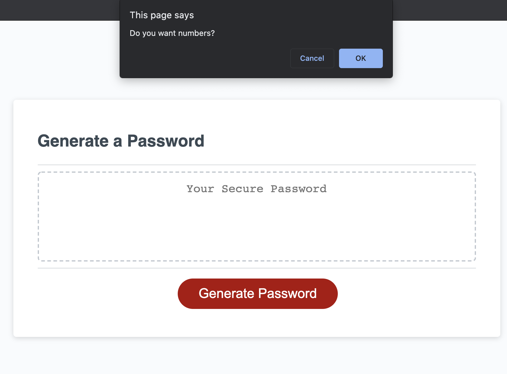
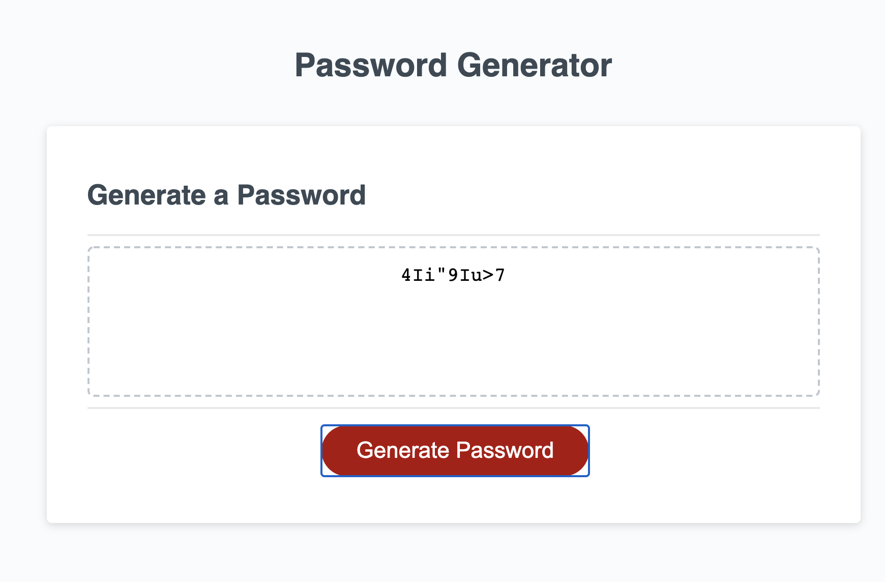
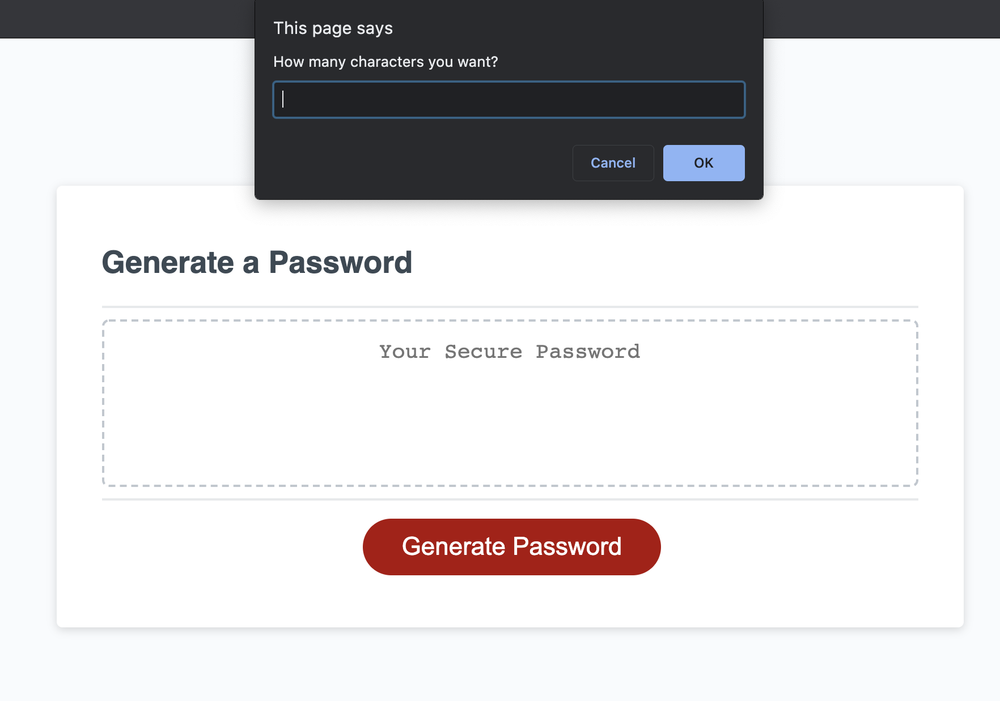

# password-generator

## Deployed Application: https://banuayozturk.github.io/password-generator/
## Description: 
This password generator project is my very first JavaScript program. 

With this project, I aimed to create a password generator with a prompt. User is asked for password lenght and character types prefered and then password written  in the page according to user choice.

Besides creating a project with JavaScript,  this project has been a good practice for me to understand the basic javaScript workflow.

## Screenshot

## Credits
 Stack Overflow
 Eloquent JavaScript  / Third Edition / Marijn Haverbeke
 Math.random, object method and more ..https://css-tricks.com/lots-of-ways-to-use-math-random-in-javascript/

## Contact Me
For any question about the project, please contact me.
[BanuAyozturk](mailto:bnyksl@gmail.com)
